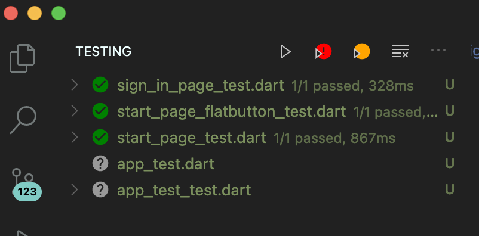
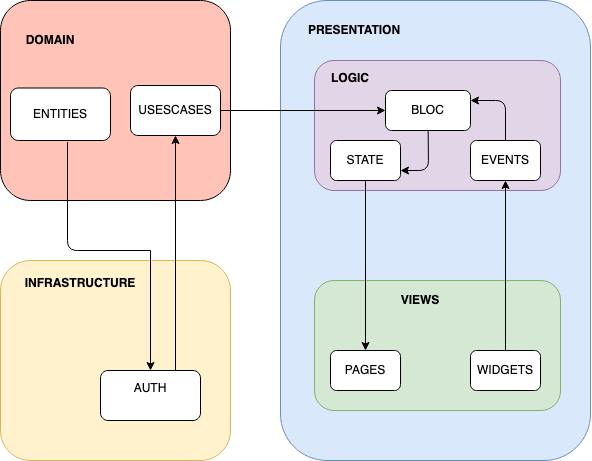

# flutter_bloc_freezed_injectable

The objective of this flutter application about asynchronous programming in Dart II.
To demostrate 
## how to manage clear architecture.

- ✅  Clean Architecture
- ✅  Testing
- ✅  Performance
- ✅  Custom Animations

## Flutter packages
 - [bloc: flutter_bloc package ] 
 - [freezed]
 - [injectable]
 - [firebase_auth]
 - [firebase_core]
 - [freezed]
 - [injectable_generator]

\b

## Testing
### ✅ Widget Test

- https://www.marialijideveloper.com

 

 

Specially thanks people  that have shared your work , allow people like me use these images:

Icons:
https://icons8.com/illustrations/style--casual-life-3d 

https://icons8.com/illustrations/style--flame

https://icons8.com/illustrations/illustration/clip-online-advertising-smm

Icons made by <a href="https://www.flaticon.com/authors/kiranshastry" title="Kiranshastry">Kiranshastry</a> from <a href="https://www.flaticon.com/" title="Flaticon">www.flaticon.com</a>

